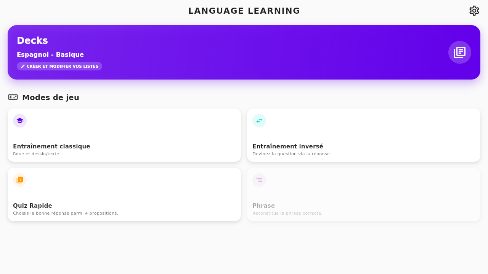
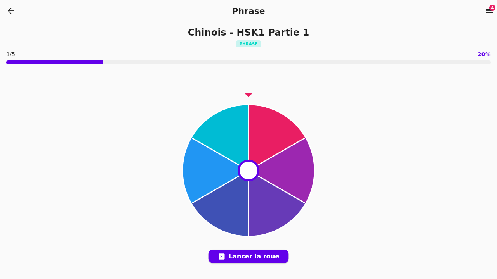

[](https://github.com/Pouple-Tim/Language-Learning-App/actions/workflows/main.yml)


# Language Learning App

Application mobile Flutter de révision de vocabulaire, avec une roue interactive, plusieurs modes de jeu et un suivi de progression. Apprends de nouveaux mots chaque jour et améliore ton vocabulaire en chinois (HSK1-HSK2) ou en anglais (A2).

<p align="center">
  
  
</p>

## Fonctionnalités

- **5 modes de jeu** : Classique (roue + saisie), Inversé, Quiz rapide, Écoute (audio), et Phrase (reconstitution de phrases mot par mot)
- **61 decks** répartis sur le chinois (HSK1-HSK2) et l'anglais (A2), classés par niveau de difficulté
- **Decks personnalisés** : crée et édite tes propres listes de mots
- **Suivi de progression** : statistiques détaillées, séries de révisions, historique par mode de jeu
- **Réinitialisation ciblée** : remets à zéro la progression d'un mode précis ou de tout un deck
- **Contenu à la demande** : les decks se téléchargent au premier usage puis restent disponibles hors-ligne (backend [Supabase](https://supabase.com))
- **Multilingue** : interface disponible en français, anglais, espagnol et italien

## Stack technique

| | |
|---|---|
| Framework | [Flutter](https://flutter.dev) 3.38 / Dart ≥3.8 |
| Gestion d'état | [Provider](https://pub.dev/packages/provider) |
| Backend | [Supabase](https://supabase.com) (contenu des decks, lecture publique) |
| Stockage local | `SharedPreferences` (progression, decks personnalisés, réglages) |
| Sérialisation | `json_serializable` / `build_runner` |
| CI | GitHub Actions (analyse + tests + build APK à chaque push sur `main`) |

## Démarrage

Prérequis : [Flutter SDK](https://docs.flutter.dev/get-started/install) (channel stable) et Android Studio ou un appareil/émulateur Android.

```bash
git clone https://github.com/Pouple-Tim/Language-Learning-App.git
cd Language-Learning-App
flutter pub get

# Génère les fichiers *.g.dart (modèles JSON)
dart run build_runner build --delete-conflicting-outputs

flutter run
```

Le contenu des decks de base est servi par un projet Supabase public en lecture seule (clé déjà configurée dans `lib/core/config/supabase_config.dart`, pas de compte requis pour lancer l'app). Pour ajouter ou modifier un deck, voir `tool/generate_deck_manifest.dart` (génère le catalogue embarqué) et `tool/seed_supabase_decks.dart` (pousse le contenu vers Supabase, nécessite une clé `service_role`).

### Tests

```bash
flutter analyze
flutter test
```

## Téléchargement

L'APK Android est généré automatiquement à chaque release : [dernière version](https://github.com/Pouple-Tim/Language-Learning-App/releases/latest).

## Licence

Ce projet est sous licence [MIT](LICENSE).
