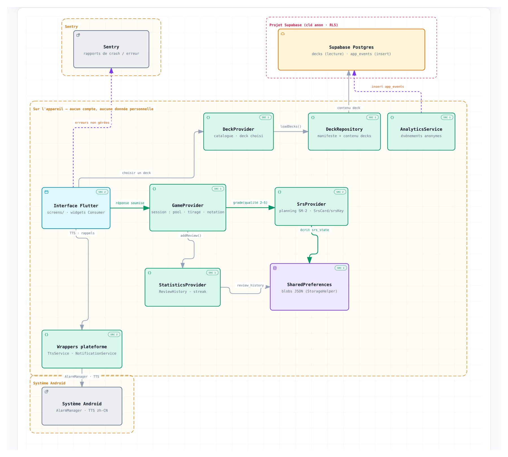

[](https://github.com/Pouple-Tim/Language-Learning-App/actions/workflows/main.yml)


# Language Learning App

Application mobile Flutter d'apprentissage du vocabulaire. Cinq modes de jeu, un
planificateur de révision espacée (SM-2), 61 decks (chinois HSK1–HSK2, anglais
A2) servis à la demande, et un suivi de progression complet. Aucun compte, aucune
donnée personnelle : toute la progression vit sur l'appareil.

---

## Sommaire

- [Ce que fait l'application](#ce-que-fait-lapplication)
- [Fonctionnement de la révision espacée](#fonctionnement-de-la-révision-espacée)
- [Architecture](#architecture)
- [Modèle de données et stockage](#modèle-de-données-et-stockage)
- [Contenu des decks](#contenu-des-decks)
- [Structure du projet](#structure-du-projet)
- [Démarrage](#démarrage)
- [Tests et CI](#tests-et-ci)
- [Vie privée](#vie-privée)
- [Licence](#licence)

---

## Ce que fait l'application

### Modes de jeu

| Mode | Épreuve | Saisie |
|---|---|---|
| **Classique** | prompt → réponse (ex. pinyin → hanzi, ou français → mot) | clavier, ou tracé libre sur les decks à écriture |
| **Inversé** | même chose, sens inverse | clavier / tracé |
| **Quiz** | reconnaissance | QCM à 4 choix (1 bonne réponse + 3 distracteurs tirés du deck) |
| **Écoute** | le mot est prononcé (TTS), retrouve-le | QCM à 4 choix |
| **Phrase** | reconstituer une phrase | blocs de mots à ordonner |

Il n'y a plus de roue à faire tourner : le mot ou la phrase suivant·e est tiré·e
automatiquement du pool de la session.

### Session de révision

Avant chaque partie, un **écran de pré-sélection** propose quatre filtres, avec
un compteur en temps réel pour chacun :

- **Réviser tout** — tous les éléments du deck, ignore le planificateur ;
- **À réviser aujourd'hui** — les éléments dont la date SM-2 est échue, plus les
  jamais-vus (filtre par défaut) ;
- **Nouveaux mots** — uniquement les éléments sans historique ;
- **Mots difficiles** — les éléments dont la dernière révision a été ratée ou
  laborieuse.

Le dernier filtre choisi est mémorisé par couple (deck, mode).

### Suivi de progression

- **Objectif quotidien** configurable (Léger 10 / Normal 20 / Intense 40
  révisions par jour), avec un anneau de progression et une notification
  ponctuelle quand l'objectif est atteint.
- **Série de jours** (streak) — jours consécutifs avec au moins une révision,
  affichée sur l'accueil (cliquable → statistiques).
- **Résumé de fin de partie** — mots appris dans la session, réussis du premier
  coup, et la liste dépliable des mots ratés au moins deux fois (`prompt → réponse`).
- **Écran de statistiques** — révisions par jour (7 j), heatmap mensuelle, top 5
  des decks, répartition par mode de jeu, total de mots appris.
- **Rappels quotidiens** locaux, optionnels, à l'heure de ton choix (fenêtre
  glissante de 14 notifications one-shot ré-armée à chaque ouverture ; ignore les
  jours déjà pratiqués).

### Decks

- **61 decks** : chinois HSK1 (19), HSK2 (19), anglais A2 Key (23), chaque
  famille déclinée en parties courtes + agrégats.
- **Decks personnalisés** créés et édités dans l'app.
- **Réinitialisation ciblée** — remise à zéro d'un mode précis, de tout un deck
  (efface aussi la programmation SM-2 du deck), ou de toutes les données.

### Divers

- Interface en **français, anglais, espagnol, italien** (`flutter gen-l10n`, ICU
  plurals).
- Thème clair / sombre.
- Bouton de **retour d'expérience** intégré (mailto pré-rempli).
- Écran d'**onboarding** statique au premier lancement + guide des modes de jeu.

---

## Fonctionnement de la révision espacée

Le cœur du planificateur est **SM-2 « manuel »**, sans paliers d'apprentissage
(`lib/core/srs/sm2.dart`, pur Dart, sans dépendance Flutter, entièrement testé
unitairement).

### Le modèle

Chaque `srsKey` porte une carte `SrsCard { reps, ef, intervalDays, due, lastQuality }` :

- `ef` (ease factor) démarre à 2,5, plancher à 1,3 ;
- après une réponse de qualité `q` :
  - `q ≥ 3` : `reps == 0 → intervalle 1 j`, `reps == 1 → 6 j`, sinon
    `round(intervalle × ef)` ;
  - `q < 3` (lapse) : `reps → 0`, intervalle → 1 j ;
  - `ef ← ef + (0,1 − (5−q)(0,08 + (5−q)·0,02))`, borné à 1,3 ;
- `due = aujourd'hui + intervalle` (date locale, sans heure).

### La qualité est dérivée automatiquement

Pas de boutons « Encore / Bien / Facile ». La note vient du nombre de
soumissions fausses sur l'élément pendant la session courante
(`GameProvider._sessionMistakes`) :

| fautes dans la session | qualité |
|---|---|
| 0 | 5 (premier coup) |
| 1 | 4 |
| 2 | 3 |
| ≥ 3 | 2 (lapse — l'intervalle repart à 1 j) |

Un élément est noté **une seule fois**, à sa première bonne réponse de la session.

### Une piste par (élément, mode de jeu)

La `srsKey` est `<wordId>::<mode>` pour les mots et
`<deckId>::<sentenceId>::<mode>` pour les phrases. Écrire, reconnaître et écouter
un mot sont trois compétences distinctes : chaque mode a donc sa propre
programmation. Réinitialiser un deck efface les cinq pistes.

### Prédicats de filtre

| filtre | prédicat |
|---|---|
| `all` | tout |
| `due` | `carte == null` (jamais vu) ou `due ≤ aujourd'hui` |
| `fresh` | `carte == null` |
| `hard` | `carte != null && lastQuality < 4` |

### Ce que ça remplace

L'ancien mécanisme réinitialisait tout le deck chaque jour calendaire (et
seulement le deck+mode chargé). Il a été **entièrement retiré** :
`checkDailyReset`, la bannière « Nouveau jour », le champ `Settings.lastReset`.
Les drapeaux « fait aujourd'hui » (`Word.removed` / `Sentence.completed`) sont
désormais un état de session en mémoire, jamais persisté — la seule source de
programmation est la date SM-2.

---

## Architecture

Flutter + [Provider](https://pub.dev/packages/provider). Séparation en couches :
logique pure (`lib/core`), état applicatif (`lib/providers`), accès données
(`lib/data`), UI (`lib/screens`).

### Vue d'exécution

[](docs/architecture/runtime-arch.html)

Composants d'exécution, chemin principal (boucle de révision, en vert), dépendances
externes et frontières de confiance. Version interactive (pan/zoom, vues guidées,
liens vers le code) : [`docs/architecture/runtime-arch.html`](docs/architecture/runtime-arch.html)
— source du diagramme : [`runtime-arch.json`](docs/architecture/runtime-arch.json)
(généré avec [archify](https://github.com/tt-a1i/archify)).

- **Chemin principal** — l'UI soumet une réponse à `GameProvider`, qui note l'élément
  via `SrsProvider.grade()` (SM-2 pur, `core/srs/sm2.dart`), journalise la révision
  dans `StatisticsProvider`, puis persiste dans `SharedPreferences`.
- **Chargement des decks** — `DeckProvider` → `DeckRepository` → table Supabase
  `decks` (lecture anonyme), mis en cache localement à la première sélection.
- **Sorties de l'appareil** — `AnalyticsService` insère des événements anonymes dans
  `app_events` (fire-and-forget) ; `Sentry` reçoit les erreurs non gérées ; les
  `Wrappers plateforme` appellent l'`AlarmManager` et le moteur TTS d'Android.
- **Frontières de confiance** — toute la progression reste sur l'appareil (aucun
  compte, aucune donnée personnelle) ; la clé Supabase est publique et bornée par
  RLS (`decks` en lecture seule, `app_events` en insertion seule).

### Providers (`ChangeNotifier`)

| Provider | Rôle | Persistance |
|---|---|---|
| `ThemeProvider` | thème clair/sombre | `Settings` (blob `app_settings`) |
| `LocaleProvider` | langue de l'interface | clé dédiée |
| `DeckProvider` | catalogue, deck sélectionné, téléchargement du contenu | `custom_decks`, `current_deck`, `downloaded_deck_<id>` |
| `GameProvider` | partie en cours : pool filtré, tirage, vérification, notation SM-2, compteurs de session | rien (état volatil) |
| `StatisticsProvider` | historique de révision (`ReviewHistory`), streak, agrégats | `review_history` |
| `GoalProvider` | niveau d'objectif + tampon « célébré aujourd'hui » | `daily_goal_level`, `daily_goal_celebrated_date` |
| `ReminderProvider` | activation + heure des rappels | `reminder_enabled`, `reminder_time` |
| `SrsProvider` | planning SM-2 (une `SrsCard` par `srsKey`) + dernier filtre par deck+mode | `srs_state`, `session_filter_by_deck` |

`GameProvider` reçoit `StatisticsProvider` et `SrsProvider` par injection
(`ChangeNotifierProxyProvider2`). Les providers récents (`Goal`, `Reminder`,
`Srs`) possèdent leurs propres clés `SharedPreferences` brutes plutôt que
d'étendre le modèle `Settings` généré — pas de migration codegen à chaque ajout.

### Logique pure et testable (`lib/core`)

- `srs/sm2.dart` — l'algorithme SM-2 (`SrsCard`, `reviewCard`, `SessionFilter`).
- `goal/daily_goal.dart` — presets, calcul de progression, décision de
  célébration.
- `notifications/notification_schedule.dart` — construction de la fenêtre
  glissante de rappels (`buildReminderSchedule`, fonction pure).
- `utils/date_helper.dart`, `audio/tts_service.dart`, `analytics/analytics_service.dart`.

### Point d'accroche unique du jeu

Toute la sélection d'élément passe par `GameProvider.spinWheel()` /
`_loadNextSentence()`, qui filtrent
`words.where((w) => !w.removed && srsProvider.matches(filter, srsKey(w)))`.
`isCompleted` utilise le même prédicat : la partie se termine quand le pool
**filtré** est vide, pas quand le deck entier l'est.

---

## Modèle de données et stockage

Aucune base locale : tout est du JSON dans `SharedPreferences`, via
`StorageHelper`.

| Clé | Contenu |
|---|---|
| `app_settings` | `Settings` (thème, deck courant) |
| `review_history` | `ReviewHistory` — une entrée par soumission, purgée à 90 jours |
| `srs_state` | `{ "<srsKey>": {reps, ef, interval, due, lastQuality} }` |
| `session_filter_by_deck` | `{ "<deckId>_<mode>": "due" }` |
| `daily_goal_level`, `daily_goal_celebrated_date` | objectif quotidien |
| `reminder_enabled`, `reminder_time` | rappels |
| `custom_decks` | decks utilisateur (JSON complet) |
| `current_deck` | id du deck sélectionné |
| `downloaded_deck_<id>` | contenu d'un deck de base, mis en cache après le 1er téléchargement |
| `analytics_device_id` | UUID anonyme généré sur l'appareil |

Les modèles (`Deck`, `Word`, `Sentence`, `Settings`, `ReviewHistory`,
`DeckManifest`) sont sérialisés par `json_serializable` ; les fichiers `*.g.dart`
sont committés.

`Word.id` suit la convention `<deckId>_wN` (stable, jamais renumérotée) — c'est
ce qui rend les cartes SM-2 propres à un deck.

---

## Contenu des decks

Le **catalogue** (`assets/decks/manifest.json`, 61 entrées : catégories,
difficulté, nombre de mots, présence de phrases) est embarqué dans l'APK et
généré par `tool/generate_deck_manifest.dart`.

Le **contenu** (mots, phrases) des decks de base est servi par un projet
[Supabase](https://supabase.com) public en lecture seule (table `decks`, colonne
`content`), téléchargé au premier usage puis disponible hors-ligne. La clé
publiable est déjà dans `lib/core/config/supabase_config.dart` — aucun compte
n'est requis pour lancer l'app.

Pour **ajouter ou modifier un deck** : éditer les sources sous `assets/decks/`,
régénérer le manifest, puis pousser vers Supabase avec
`tool/seed_supabase_decks.dart` (nécessite une clé `service_role`).

---

## Structure du projet

```
lib/
├── core/            logique pure (srs, goal, notifications), thème, utils, config
├── data/
│   ├── models/      Deck, Word, Sentence, Settings, ReviewHistory (+ *.g.dart)
│   └── repositories/  DeckRepository, SettingsRepository
├── providers/       8 ChangeNotifier (voir Architecture)
├── screens/         home, decks, games, stats, settings, onboarding
├── l10n/            app_{en,fr,es,it}.arb + localisations générées
└── main.dart        init (Storage, Supabase, Sentry, notifications) + MultiProvider

assets/decks/        manifest.json + sources des decks
tool/                generate_deck_manifest.dart, seed_supabase_decks.dart
test/                tests unitaires (srs, providers, modèles, utils)
```

---

## Démarrage

Prérequis : [Flutter SDK](https://docs.flutter.dev/get-started/install) 3.47+
(channel stable), Dart ≥ 3.8, et un appareil ou émulateur Android.

```bash
git clone https://github.com/Pouple-Tim/Language-Learning-App.git
cd Language-Learning-App
flutter pub get

# Génère les *.g.dart (modèles JSON)
dart run build_runner build --delete-conflicting-outputs

flutter run
```

`flutter gen-l10n` s'exécute automatiquement au build (`flutter: generate: true`).

---

## Tests et CI

```bash
flutter analyze     # 0 issue attendu
flutter test        # tests unitaires
```

Couverture unitaire notable : l'algorithme SM-2 (deltas d'ease vérifiés à la
main, plancher, lapse, round-trip JSON), `SrsProvider` (prédicats, persistance),
`GameProvider` (pool filtré, notation, fin de session), `buildReminderSchedule`,
`daily_goal`, les modèles et repositories.

La CI GitHub Actions (`.github/workflows/main.yml`) lance `flutter analyze`,
`flutter test` et `flutter build apk --release` à chaque push et PR sur `main`,
et publie l'APK en artefact.

Branches : `develop` (intégration continue) → `main` (release). Le build release
est signé avec la clé debug (`android/app/build.gradle.kts`) — le keystore de
publication viendra avant une mise en magasin.

---

## Vie privée

- **Aucun compte, aucune authentification.** Toute la progression
  (SM-2, historique, objectif, streak, decks personnalisés) reste sur
  l'appareil.
- **Analytics minimal et anonyme** : quelques événements (`app_opened`,
  `deck_selected`, `game_started`, `deck_completed`, `daily_goal_reached`, …)
  écrits en insertion-seule dans une table Supabase dédiée, avec un UUID généré
  localement et la version de l'app. Aucune donnée personnelle, aucun identifiant
  d'appareil réel.
- **Crash reporting** [Sentry](https://sentry.io) — désactivé tant qu'aucun DSN
  n'est configuré.
- **Supabase** n'est utilisé qu'en lecture pour le contenu des decks et en
  insertion pour les événements anonymes.

---

## Licence

[MIT](LICENSE).
